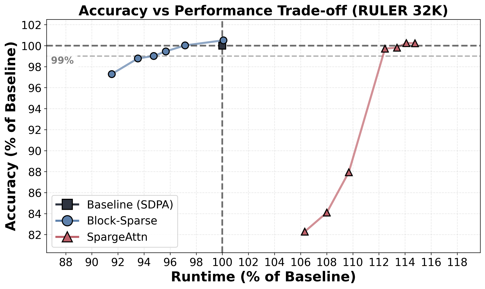
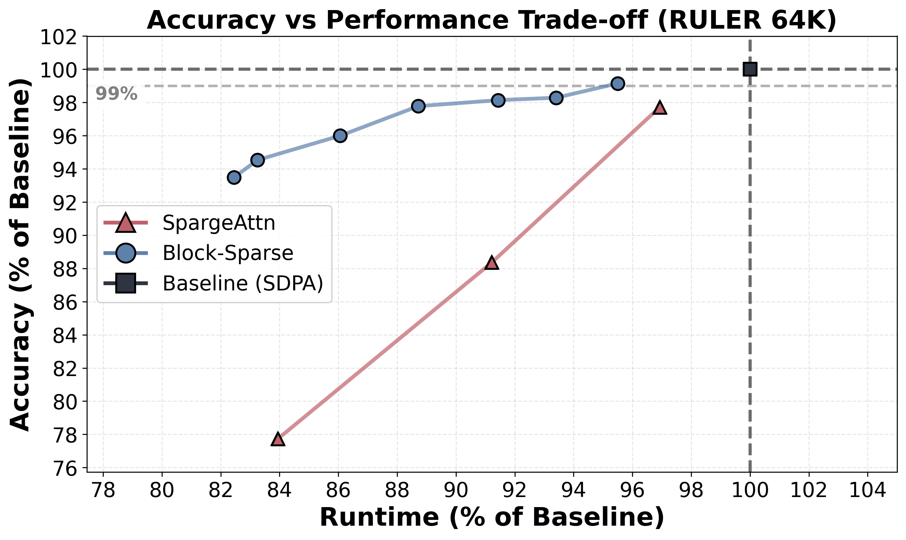
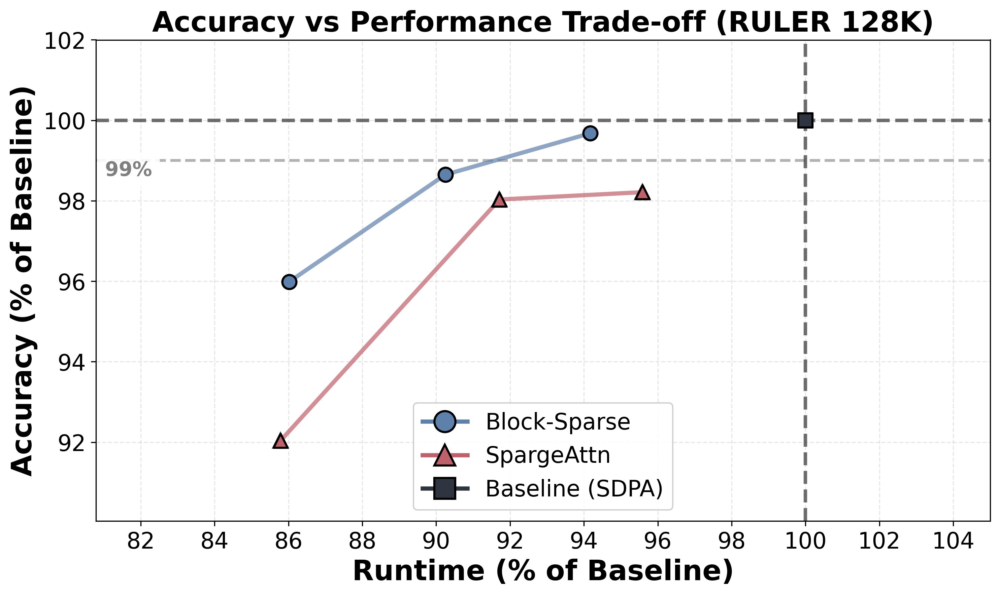
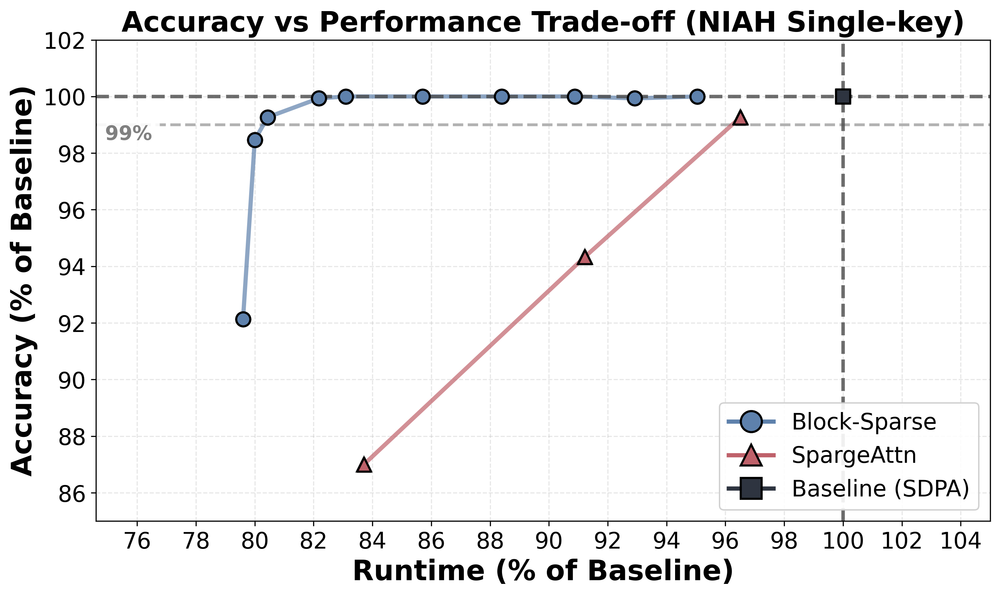

# Block-Sparse Flash Attention

[](https://arxiv.org/abs/2512.07011)

This is the official implementation of the paper [Block Sparse Flash Attention](https://arxiv.org/abs/2512.07011).

**Block-Sparse FlashAttention (BSFA)** is a drop-in replacement for FlashAttention that accelerates long-context inference while preserving model quality. Unlike methods that predict importance before computing scores, BSFA computes exact query-key similarities to select the top-k most important value blocks for each query, achieving **up to 1.24× speedup** while maintaining **above 99% baseline accuracy**.

<p align="center">
  
  
  
</p>
<p align="center">
  <em>Accuracy-latency trade-offs on RULER benchmark for 32K, 64K, and 128K sequences. BSFA (blue) maintains high accuracy with consistent speedups, outperforming SpargeAttention (orange).</em>
</p>

## Highlights

- **1.10× speedup** on real-world reasoning tasks (LongBench) with 99% accuracy retention
- **1.24× speedup** on needle-in-a-haystack retrieval with 99% accuracy
- **Training-free**: Only requires one-time threshold calibration on 16 samples
- **Drop-in replacement**: Extends FlashAttention-2 with minimal code changes
- **FP16 precision**: No quantization required, unlike competing methods

## Method Overview

BSFA takes a fundamentally different approach from existing sparse attention methods:

1. **Compute exact QK scores**: All query-key similarities are computed exactly within FlashAttention's tiled framework
2. **Threshold-based gating**: For each block, compare the maximum score against a calibrated threshold specific to that layer, head, and position
3. **Skip V blocks**: Blocks with maximum scores below the threshold are not selected—their values are neither loaded from HBM nor multiplied by attention scores

This preserves the fidelity of attention patterns while eliminating approximately **50% of FLOPs** (the PV multiplication) and **50% of memory bandwidth** (V block loading) for skipped blocks.

<p align="center">
  
</p>
<p align="center">
  <em>BSFA's content-aware sparsity excels at targeted retrieval: 99% accuracy at k=32 blocks with 1.24× speedup on 64K Needle-in-a-Haystack.</em>
</p>

## Installation

### Tested Environment

This implementation has currently been tested on NVIDIA A100 GPUs with CUDA 12.1 using the following Docker image. We are working on adding support for additional GPU architectures and CUDA versions. Other configurations may work but have not been validated.

```
pytorch/pytorch:2.4.1-cuda12.1-cudnn9-devel
```

### Requirements

- **Docker image**: `pytorch/pytorch:2.4.1-cuda12.1-cudnn9-devel` (recommended)
- **GPU**: NVIDIA A100 (SM 8.0) — other architectures may require modification

### Step-by-Step Installation

```bash
# 1. Clone the repository
git clone https://github.com/Danielohayon/Block-Sparse-Flash-Attention.git
cd Block-Sparse-Flash-Attention

# 2. Clone CUTLASS (required for kernel compilation)
cd kernel_src/csrc
git clone https://github.com/NVIDIA/cutlass.git
cd cutlass && git checkout v3.5.1 && cd ..
cd ../..

# 3. Build the custom CUDA kernel
cd kernel_src
export FLASH_ATTN_CUDA_ARCHS="8.0"  # A100
export MAX_JOBS=8  # Adjust based on available memory
python setup.py install
cd ..

# 4. Install Python dependencies (torch is already in the Docker image)
pip install transformers accelerate
```

## Quick Start

```python
import torch
from transformers import AutoModelForCausalLM, AutoTokenizer

# Add model_patching to path
import sys
sys.path.append('./model_patching')
from custom_attention_injector import AttentionConfig, inject_custom_attention

# Load model
model = AutoModelForCausalLM.from_pretrained(
    "meta-llama/Llama-3.1-8B-Instruct",
    torch_dtype=torch.float16,
    device_map="auto",
)
tokenizer = AutoTokenizer.from_pretrained("meta-llama/Llama-3.1-8B-Instruct")

# Configure block-sparse attention
config = AttentionConfig(
    mode="block_sparse",
    threshold_file="./thresholds/llama_3.1_8B_instruct/thresholds_64k.pt",
    block_sparse_topk=64,  # Number of off-diagonal blocks to retain
)

# Inject custom attention (modifies model in-place)
inject_custom_attention(model, config)

# Use model as normal
inputs = tokenizer("Your long context here...", return_tensors="pt").to(model.device)
outputs = model.generate(**inputs, max_new_tokens=100)
print(tokenizer.decode(outputs[0]))
```


## Pre-computed Thresholds

Pre-calibrated thresholds for Llama-3.1-8B-Instruct are available in [`thresholds/llama_3.1_8B_instruct/`](thresholds/llama_3.1_8B_instruct/):

| File | Sequence Length | Size |
|------|-----------------|------|
| `thresholds_32k.pt` | Up to 32K tokens | 16 MB |
| `thresholds_64k.pt` | Up to 64K tokens | 31 MB |
| `thresholds_128k.pt` | Up to 128K tokens | 75 MB |

**Choosing k (sparsity level)**:
- Higher k = more blocks retained = higher accuracy, lower speedup
- Lower k = fewer blocks retained = lower accuracy, higher speedup
- Recommended: Start with k=64-96 for general tasks, k=32 for retrieval-heavy tasks

## Calibrating Custom Thresholds

To calibrate thresholds for your own model or dataset:

```bash
cd thresholds

python calibrate.py \
    --model meta-llama/Llama-3.1-8B-Instruct \
    --data_file your_calibration_data.json \
    --max_seq_len 65536 \
    --thresholds_save_path ./my_thresholds.pt
```

The calibration process:
1. Runs the model on calibration samples
2. Collects attention score distributions per layer/head/position
3. Computes thresholds that retain exactly the top-k blocks
4. Saves thresholds for multiple k values in a single file

See [`thresholds/README.md`](thresholds/README.md) for detailed options.

## Results

### LongBench Benchmark

| Method | Sparsity | Accuracy | Speedup |
|--------|----------|----------|---------|
| Dense FlashAttention-2 | All | 40.24% | 1.00× |
| BSFA | k=96 | 39.88% (-0.9%) | 1.10× |
| SpargeAttention | τ=0.5 | 33.11% (-17.7%) | 1.02× |

## Citation

If you find this work useful, please cite:

```bibtex
@misc{ohayon2025blocksparseflashattention,
  title={Block Sparse Flash Attention},
  author={Daniel Ohayon and Itay Lamprecht and Itay Hubara and Israel Cohen and Daniel Soudry and Noam Elata},
  year={2025},
  eprint={2512.07011},
  archivePrefix={arXiv},
  primaryClass={cs.LG},
  url={https://arxiv.org/abs/2512.07011},
}
```

## Acknowledgements

We thank the [FlashAttention](https://github.com/Dao-AILab/flash-attention) team for their foundational work that this project builds upon.
